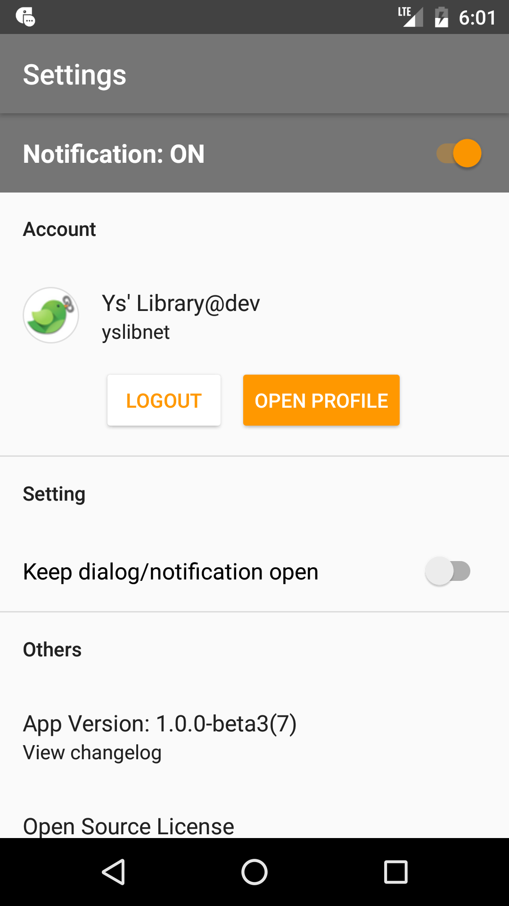
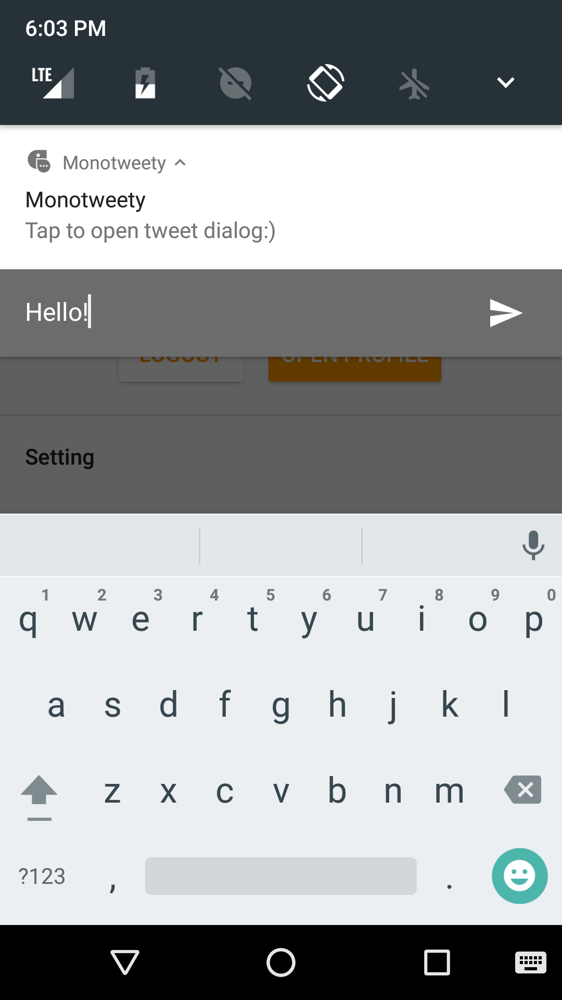
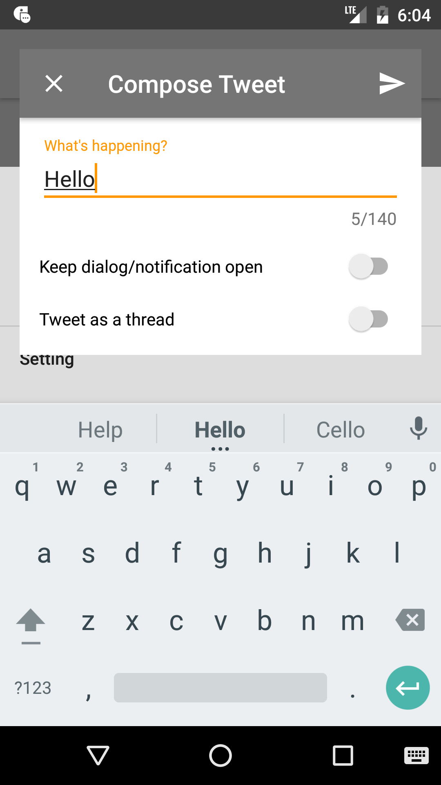

# Monotweety

Simple Twitter Client just for tweeting.

## Overview

Monotweety is Twitter client app which specializes in tweeting right from your device's notification area.

When you tap the notification, editor dialog will be launched, and you can tweet from there.

If your device is Android 7.0 or up, you can literally tweet from your notification area.

Features include:

- tweet from notification area
- chain tweets as a thread 

## Architecture

Monotweety uses following approach/libraries

- [Kotlin](https://kotlinlang.org/)
- Reactive MVVM-like architecture
- [Dagger2](https://github.com/google/dagger) for Dependency Injection
- [Conductor](https://github.com/bluelinelabs/Conductor) for building View-based application
- [RxJava](https://github.com/reactivex/rxjava) for async/reactive programming

## Screenshots

|splash|setting|notification|editor
|---|---|---|---|
|||

TBD

## How to build

- Fill `secrets.properties.template` and rename to `secrets.properties`.
- Create Firebase project and download `google-services.json`, which should have two properties; `net.yslibrary.monotweety` and `net.yslibrary.monotweety.debug`.

TBD
